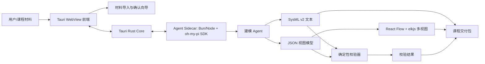

# 课程大实践项目总方案：MBSE 建模工作台

## 结论

项目定位为 **MBSE 建模工作台**：一个基于 Tauri 的桌面应用，围绕天问二号探测器案例完成“材料导入 + 向导确认 → Agent 生成 SysML v2 → JSON 视图模型 → 多视图展示 → 静态校验 → 课程交付包”的闭环。

## 已锁定决策

1. **产品边界**：MBSE 建模工作台，不做纯图浏览器、纯 Agent 控制台或 Sysbuilder 自动化脚本集合。
2. **桌面外壳**：Tauri。Rust Core 管理本地能力、进程和 IPC，WebView 前端负责交互。
3. **模型数据源**：SysML v2 文本 + JSON 视图模型。SysML v2 负责标准化语义与提交工件，JSON 负责前端渲染。
4. **Agent 集成**：Tauri 启动本地 Agent Sidecar；Sidecar 使用 pi / oh-my-pi SDK，向前端暴露项目自定义结构化事件。ACP 可作为后续互操作适配层，不作为首个集成边界。
5. **演示案例**：天问二号探测器。
6. **输入方式**：材料导入 + 向导确认。Agent 先抽取候选使命、需求、分系统、约束和关系，用户确认后生成模型。
7. **视图集合**：需求视图、BDD、活动图、追溯矩阵、IBD、参数约束视图。
8. **IBD/参数深度**：可视化 + 静态校验，不做拖拽式完整图编辑、仿真求解或 Sysbuilder/Sysplorer 工程导出。
9. **图形栈**：React Flow + elkjs。
10. **生成流程**：单 Agent + 确定性校验。
11. **交付边界**：完整课程交付包。

## 推荐架构

## 模块边界

### Tauri Core

- 启动、监控和停止 Agent Sidecar。
- 管理本地项目目录、导入文件、导出交付包。
- 提供前端命令接口：创建项目、保存项目、运行生成、运行校验、导出报告。

### 前端工作台

- **导入页**：粘贴/导入天问二号任务与需求材料。
- **确认向导**：确认 Agent 抽取出的使命、需求、分系统、约束、接口、追溯候选。
- **多视图页**：展示需求视图、BDD、活动图、追溯矩阵、IBD、参数约束视图。
- **校验页**：展示 schema、引用、一致性、覆盖、参数缺失等问题。
- **导出页**：导出 SysML v2、JSON、截图、报告素材。

### Agent Sidecar

- 使用 pi / oh-my-pi SDK 创建和管理 AgentSession。
- 将工作台请求转换为 Agent prompt 与结构化输出约束。
- 通过本地 WebSocket/JSON-RPC 向 Tauri 发送进度、文本、模型草案、修正建议和错误。

### 模型核心

- `model.sysml`：权威 SysML v2 文本。
- `view-model.json`：用于前端渲染的规范化 JSON。
- `validation.json`：确定性校验结果。
- `project.json`：工作台项目元数据。

## 非目标

- 不实现完整 Sysbuilder 图编辑器。
- 不承诺生成可被 Sysbuilder/Sysplorer 原生打开的工程。
- 不做参数求解、Modelica 仿真或联合仿真。
- 不把多 Agent 协作作为首个核心卖点。
- 不把 ACP/A2A 作为首个集成协议；后续可在 Sidecar 外层加适配。

## 技术调查依据

- Tauri 官方文档说明其以 Rust Core + OS WebView + IPC 组织桌面应用，并采用多进程模型与最小权限原则：`https://v2.tauri.app/concept/architecture/`、`https://v2.tauri.app/concept/process-model/`。
- Agent Client Protocol 主要标准化编辑器/IDE 与 coding agent 通信；Agent Communication Protocol / A2A 更偏跨 Agent REST 互操作。当前项目更需要 MBSE 结构化事件，因此先用 SDK Sidecar。
- oh-my-pi SDK 提供 `createAgentSession`、事件订阅、模型/auth/session/tool 管理，适合 Sidecar 直接嵌入：`https://github.com/can1357/oh-my-pi/blob/HEAD/docs/sdk.md`。
- SysON 与 Open-MBEE SysML v2 可视化服务都说明 SysML v2 Web 建模、文本导入/导出、API 和可视化是合理方向。
- React Flow 提供节点/边/端口/交互基础，但不内置布局；elkjs 提供 ELK 布局，适合有方向、端口和层级的节点连线图。

## 首个实现切片

1. 创建 Tauri + React + TypeScript 项目骨架。
2. 定义 `project.json`、`view-model.json`、`validation.json` 的最小 schema。
3. 写入一份天问二号示例材料。
4. 先用固定样例 JSON 渲染需求视图和 BDD，接入 elkjs 自动布局。
5. 加入静态校验器：重复 ID、缺失引用、未覆盖需求、端口连接缺失、参数缺失。
6. 接入 Agent Sidecar，使材料导入后生成同样 schema 的模型草案。
7. 扩展活动图、追溯矩阵、IBD、参数约束视图。
8. 导出完整课程交付包与报告素材。
